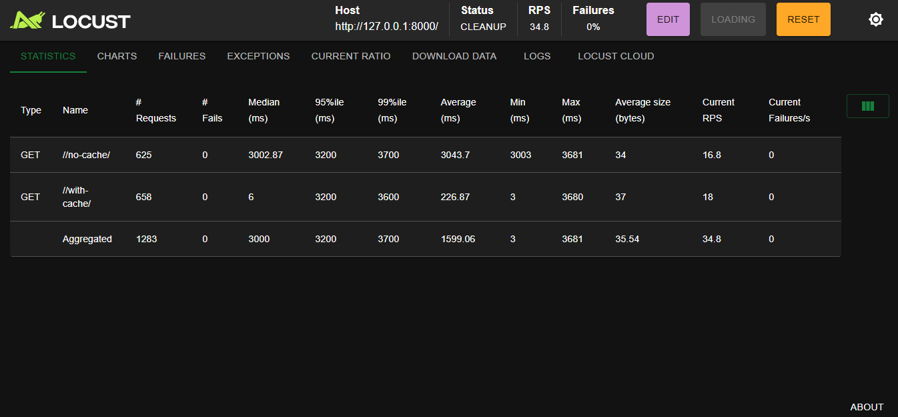

# 🚀 Django Redis Benchmark with Locust

This project demonstrates how Redis caching improves Django performance, benchmarked using Locust.

---

## 🧱 Tech Stack

- Django (Python)
- Redis (via Docker)
- Locust (for benchmarking)
- Docker

---

## 📦 Requirements

- Docker 🐳
- Python 3.9+ (for Locust + Django scripts)

---

## 🐳 1. Run Redis Using Docker

Make sure Docker is installed and running.

```bash
docker pull redis
docker run --name redis-server -p 6378:6379 -d redis

## ⚙️ 2. Run Django App (Locally)

Follow the steps below to set up and run the Django app:

```bash
# Create and activate virtual environment
python -m venv venv
.\venv\Scripts\activate

# Navigate to the project folder
cd redis_benchmark

# Install dependencies
pip install -r requirements.txt

# Start Django server
python manage.py runserver


## 📸 Benchmark Result Screenshot

Here’s a sample result from Locust showing performance difference between cache vs no-cache:

